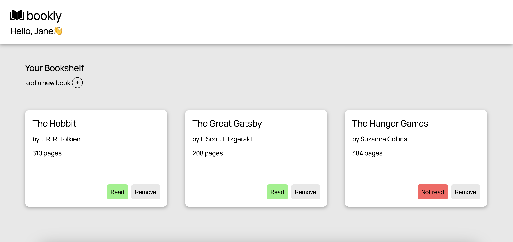

# Library

## [Live Demo](https://erinsophie.github.io/library/)

# Technologies Used 

- HTML
- CSS
- Javascript

# Project goals

- Create a personal library where users can add books to their collection
- The main idea was to learn how object constructors work and the different ways we can set an object's prototype. Particularly how Javascript is unqiue in that it uses a prototype-based inheritence model as opposed to many other languages which use a class-based inheritence model
- The original way this project was set up was with object constructors, which has since been changed to a class instead 
- The library allows users to add books represented by cards which are displayed using CSS Grid, allowing the layout to respond well to different-sized screens
- The library lets users toggle the read status and remove books from the collection
- The form does not allow users to add books that already exist in the collection and requires all fields to be filled out
- When a book is added, the first letter of the title and author will be automatically capitalised

